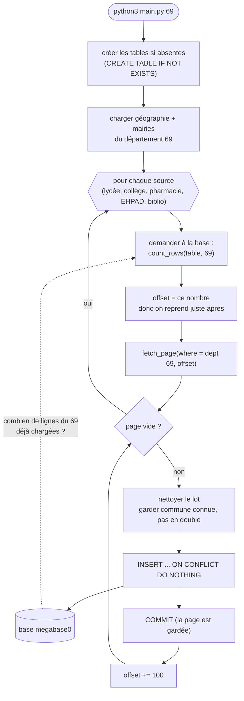

# `corrige0`


## Objectif

- Rapatrier des données publiques (établissements français) dans PostgreSQL, source
par source, avec une **reprise propre** : si le code est interrompu, relancer le code doit permettre
de "reprendre où on en était".


## Lancer pour un échantillon

```bash
createdb megabase0
pip install -r requirements.txt

python3 main.py 69     # un département : géo + mairies + lycées + collèges + pharmacies + 
                       # EHPAD + bibliothèques
python3 btp.py 69      # le BTP du département (API à part, voir plus bas)
python3 gares.py       # les gares : un seul passage, pour toute la France
```


## Lancer pour toutes les sources


```bash
# La liste des 101 départements (pas de 20 : c'est 2A/2B ; DOM 971-974, 976)
DEPTS="01 02 03 04 05 06 07 08 09 10 11 12 13 14 15 16 17 18 19 2A 2B 21 22 23 24 25 26 27 28 29 30 31 32 33 34 35 36 37 38 39 40 41 42 43 44 45 46 47 48 49 50 51 52 53 54 55 56 57 58 59 60 61 62 63 64 65 66 67 68 69 70 71 72 73 74 75 76 77 78 79 80 81 82 83 84 85 86 87 88 89 90 91 92 93 94 95 971 972 973 974 976"

# 1) Sources par département : géo + mairies + lycées + collèges + pharmacies + EHPAD + bibliothèques
for d in $DEPTS; do python3 main.py $d; done

# 2) Gares : un seul passage global
python3 gares.py

# 3) BTP par département (l'API plafonne le débit, donc la reprise sert beaucoup)
for d in $DEPTS; do python3 btp.py $d; done
```


## Vérifier l'état de la base de données


```bash
psql -d megabase0 -c "SELECT
  (SELECT count(*) FROM commune) communes, (SELECT count(*) FROM mairie) mairies,
  (SELECT count(*) FROM lycee) lycees, (SELECT count(*) FROM college) colleges,
  (SELECT count(*) FROM pharmacie) pharmacies, (SELECT count(*) FROM ehpad) ehpad,
  (SELECT count(*) FROM bibliotheque) biblios, (SELECT count(*) FROM gare) gares,
  (SELECT count(*) FROM entreprise_btp) btp;"
```


## Les fichiers

- `collect.py` : aller chercher les données (appels API)
- `clean.py` : transformer une ligne brute en dict (clés = colonnes SQL) + `code_insee` nettoyé
- `load.py` : créer le schéma, compter, insérer.
- `main.py` : l'orchestration par département (la double boucle sources x pages).
- `gares.py` : passage global pour les gares (pas de département, pas de lien commune).
- `btp.py` : le BTP par département (API recherche-entreprises, différente des autres).
- `schema.sql` : les tables. La commune au centre, géographie en 3 niveaux.

## L'idée clé : main.py vérifie l'état de la table concernée

`main.py` **ne garde aucun état dans un fichier**. Pour savoir où reprendre, il **demande
à la base ce qu'elle contient déjà** pour ce département (`count_rows`), et il repart
juste après. 

> 💡 La base est donc à la fois la cible des insertions et la référence de reprise.



Ce qui rend la reprise sûre :

- **On garde les tables** d'un run à l'autre (`CREATE TABLE IF NOT EXISTS`, pas de
  `DROP`), et **on valide chaque page** (`COMMIT`) : ce qui est inséré reste
- L'**offset** repart du nombre de lignes du département déjà présentes.
- La pagination est **triée sur la clé** (sinon l'API renvoie les pages dans un.
  ordre instable).
- Et l'insertion est en **`ON CONFLICT DO NOTHING`** : même si on essaie d'insérer une page déjà vue, on ne casse rien et ne duplique rien.

## Les sources et leur façon de se rattacher à la commune

- **Directement** (le code commune est dans la donnée) : lycées, collèges
  (éducation), pharmacies, EHPAD (FINESS), bibliothèques (culture). Ce sont les
  entrées de `SOURCES` dans `main.py`.
- **Par dérivation** : mairies, une par commune, fabriquées depuis le référentiel
  déjà chargé (`load.insert_mairies`).
- **Cas à part** :
  - **gares** (`gares.py`) : la source SNCF n'a ni code commune ni coordonnées. On
    rapatrie tout en un passage global, sans lien commune. Le rattachement (par
    géocodage) sera une étape séparée, plus tard.
  - **BTP** (`btp.py`) : recherche-entreprises n'est pas une API Opendatasoft
    (pagination par page). La commune, elle, est fournie. Cette API plafonne le
    débit : un gros département se charge en plusieurs relances (la reprise reprend
    où c'était).

## La limite Opendatasoft

`offset + limit` ne peut pas dépasser 10000. Comme on requête par département, chaque
résultat est petit, donc on ne touche jamais cette limite. Un garde-fou coupe quand
même à 10000 par sécurité. Doc : https://help.opendatasoft.com/apis/ods-explore-v2/
